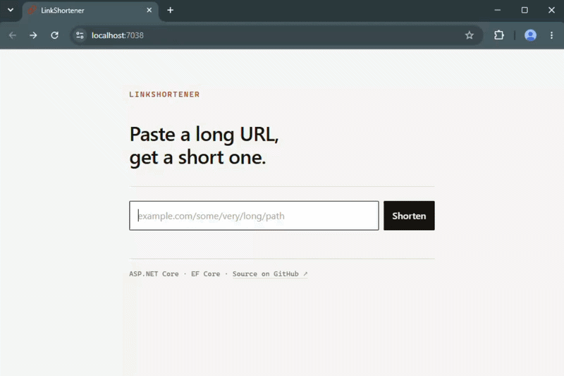

# LinkShortener

A URL shortener built with ASP.NET Core and Entity Framework Core. Paste a long URL, get a short
slug back, and get redirected when you visit it.



*Creating a link and following it, running locally. The hosted demo runs on Azure's default hostname. See [Deployment](#deployment) for more.*

## What it does

- `POST /api/links` — takes a URL, returns a 7-character slug and the full short link
- `GET /{slug}` — resolves a slug and redirects to the original URL
- `GET /` — a small landing page using the same public API

## Stack

- [.NET 10](https://dotnet.microsoft.com/) / ASP.NET Core Web API
- [Entity Framework Core](https://learn.microsoft.com/ef/core/) + SQLite
- [Azure App Service](https://azure.microsoft.com/products/app-service) (Free tier)

## Architecture notes

- Controllers handle HTTP only, `LinkService` holds the logic and never sees a `Request` object, and `AppDbContext` is never touched from a controller, which is what makes the service testable without starting a web server.
- Slugs are 7 characters formed randomly from a 62-character alphabet using `RandomNumberGenerator`, so slugs can't be predicted from ones already issued.
- Slug collisions are prevented by a unique index rather than by checking availability first. Check-then-insert would have a race between the two steps. On collision the service detaches the entity and retries with a new slug.
- Redirects have their own controller so that each file has one obvious job, which is resolving slugs for browsers rather than serving JSON to API clients.
- The frontend is served from the same app as the API: one deployment, one origin.

## Getting Started

1. Clone the repo:

   ```bash
   git clone https://github.com/david-botha/link-shortener.git
   cd link-shortener
   ```

2. Run it:

   ```bash
   dotnet run --project LinkShortener
   ```

3. Open the URL shown in the console.

There are no API keys and no database setup. SQLite creates its file on first run and migrations are applied automatically at startup.

## Deployment

Hosted on Azure App Service (Linux), with the SQLite file under `/home`, the only part of the filesystem App Service keeps across restarts and redeploys.
HTTPS is enforced on Azure rather than in code, which is why there's no
`UseHttpsRedirection()` in `Program.cs`.

Custom domains on Azure need the Basic tier, and this project is hosted on the Free tier. Thus, the official
URL is, unfortunately, https://link-shortener-gmamf0ahaec6gngb.southafricanorth-01.azurewebsites.net. 77 characters.
This means I have built the world's first link lengthener, but the logic works. The Free tier also sleeps when idle, so 
the first request after inactivity takes several seconds to wake up. This project is better run locally.

## Known limitations

Deliberate and known rather than oversights.

- **No authentication** — any visitor can create a link.
- **No rate limiting** — nothing prevents a script from creating links in bulk.
- **Open redirection** — a link shortener hides the destination by design, so a production version would need to check target URLs against a blocklist.
- **SQLite is single-instance** — appropriate at this scale, but would change if the app ever ran on more than one instance.
- **Broad exception handling** — any failed save is treated as a slug collision, so a database problem would give a misleading error.

## Roadmap

- [ ] Authentication (JWT) and link ownership
- [ ] Tests — xUnit for services, `WebApplicationFactory` for endpoints
- [ ] Narrow the collision catch so a failing database isn't reported as a slug conflict
- [ ] CI pipeline — build, test and lint on every push
- [ ] Click analytics, written asynchronously so redirects stay fast
- [ ] In-memory caching on the redirect path
- [ ] Rate limiting
- [ ] Abuse blocklist for the redirect endpoint
- [ ] Structured logging and a health endpoint
